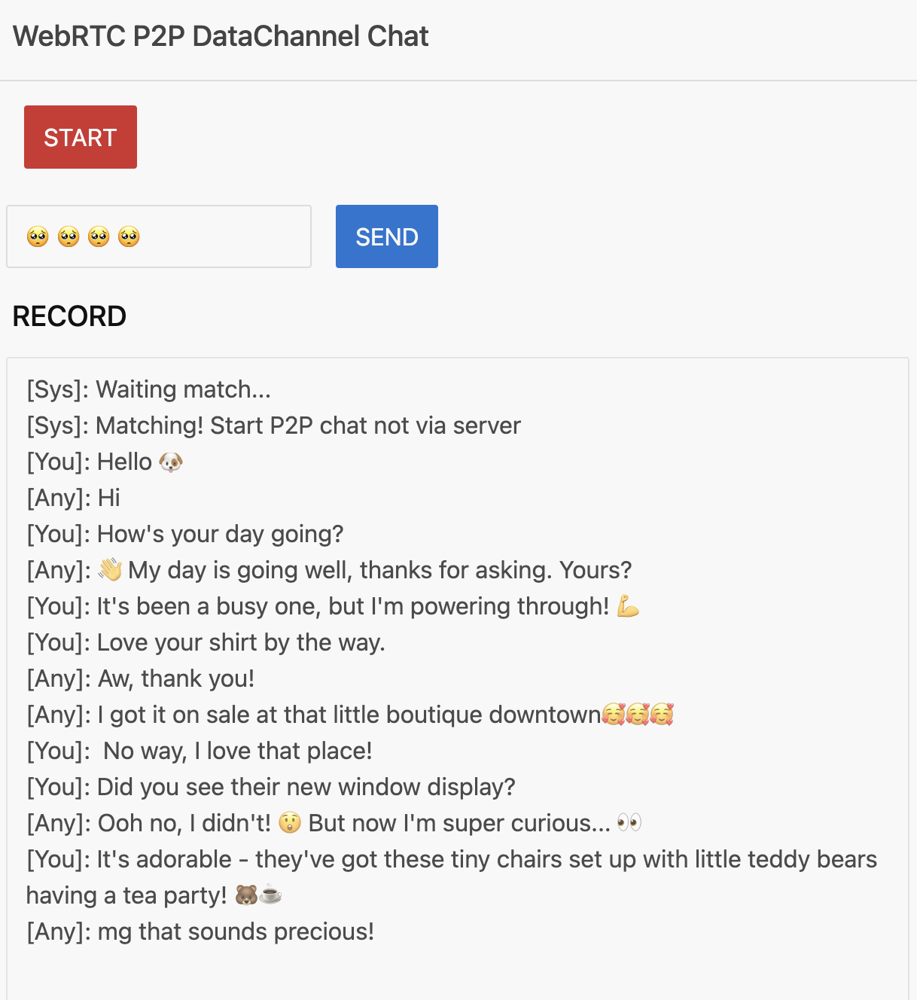

# go-wasm-p2p-chat
A chat application that utilizes the WebRTC P2P DataChannel implemented with Go WebAssembly, allowing you to match and converse with random strangers.

https://p2p-chat.pages.dev



## Backend Service
Deploy the following services as backend services:
- https://github.com/ponyo877/easy-matchmaking
  - Matchmaking server to connect users
- https://github.com/OpenAyame/ayame
  - Signaling server for WebRTC connections


## License
The source code used in `go-ayame` directory are licensed under the following licenses:
```
Copyright 2020 Kazuyuki Honda (hakobera)

Licensed under the Apache License, Version 2.0 (the "License");
you may not use this file except in compliance with the License.
You may obtain a copy of the License at

    http://www.apache.org/licenses/LICENSE-2.0

Unless required by applicable law or agreed to in writing, software
distributed under the License is distributed on an "AS IS" BASIS,
WITHOUT WARRANTIES OR CONDITIONS OF ANY KIND, either express or implied.
See the License for the specific language governing permissions and
limitations under the License.

Modifications copyright (C) 2024 ponyo877
```